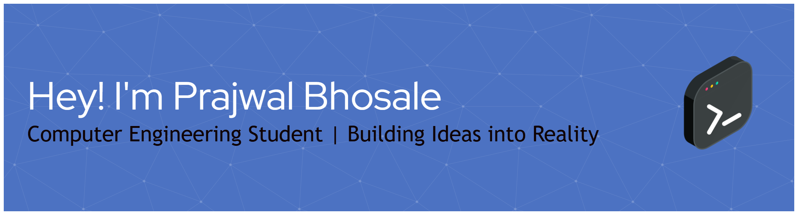

<!-- ===================================================== -->
<!--                      HEADER                           -->
<!-- ===================================================== -->

# Hi, I'm Prajwal Bhosale 👋

  
  
  

---

## ⚡ Executive Summary

🔐 **Systems & Web3 Engineer** focused on privacy-preserving computation (FHE), compilers/systems programming, and applied ML pipelines — a published researcher targeting international research internships and global systems/Web3 roles.

- 🎓 **Education:** B.Tech in Computer Engineering @ Vishwakarma Institute of Technology (VIT), Pune — 5th semester, CGPA 8.6, graduating 2028
- 👑 **Leadership:** President @ Microsoft Learn Student Club (MLSC), VIT
- 🏆 **Hackathons:** ETHGlobal New Delhi Finalist; Fhenix FHE Hackathon (AI track)
- 📄 **Research:** Co-author (3rd), ICIRSET 2025 — *"Cityzen: A Machine Learning Pipeline for Automating Urban Governance..."* (SciTePress)
- 🎯 **Focus Areas:** Fully Homomorphic Encryption (FHE), compiler & DSL design, Web3 protocols, applied ML for civic systems
- ⚔️ **Competitive Programming:** Actively training on Codeforces & LeetCode — hard-difficulty DP, graph, and binary-search problems in C++

---

## 🛠️ Tech Stack & Tooling

| Category | Technologies |
| :--- | :--- |
| **Languages** | `C++` (primary) `TypeScript` `JavaScript` `Solidity` `Python` |
| **Systems / Compilers** | `GCC toolchain` `DSL / compiler design` `eBPF (exposure)` |
| **Web3** | `Solidity` `Ethers.js` `Hardhat` `Fhenix CoFHE (FHE)` |
| **Backend** | `Node.js` `Express.js` `REST APIs` |
| **Frontend** | `React` `Next.js` `TailwindCSS` |
| **Databases** | `PostgreSQL` `MongoDB` `Supabase` |
| **Cloud & DevOps** | `AWS` `Docker` `Git` `GitHub Actions` |
| **AI / ML** | `Google ML Kit (OCR)` `Applied ML pipelines (ICIRSET 2025)` |

 

<!-- Interactive Icon Cloud -->

  

---

## 🏆 Competitive Programming

&nbsp;&nbsp;

> Currently focused on hard-difficulty **DP, graph, and binary-search** problems in C++.

---

## 🚀 Featured Projects

<table width="100%">
  <tr>
    <td width="50%" valign="top">
      <h3 align="center"><b>01. FinVeil</b></h3>
      

        
      

      

      
Privacy-preserving financial credibility system — an FHE-based "encrypted financial passport" with scoped disclosure permits, built on <b>Fhenix CoFHE</b>.

      <ul>
        <li><b>Origin:</b> FHE BUIDL Mumbai hackathon; refined at Fhenix FHE Hackathon (AI track).</li>
        <li><b>Ownership:</b> Full-stack + blockchain integration.</li>
        <li><b>Tech Stack:</b> Solidity, React, Node.js/TypeScript, Supabase.</li>
      </ul>
      <!-- TODO: Insert GitHub link once repo is shared (currently under teammate's repo). -->
    </td>
    <td width="50%" valign="top">
      <h3 align="center"><b>02. PBLang Compiler</b></h3>
      

        
      

      

      
Educational programming language that <b>transpiles to C</b>, compiled via <b>GCC</b>.

      <ul>
        <li><b>Scope:</b> Full compiler pipeline — lexer, parser, code generation.</li>
        <li><b>Signals:</b> Compiler design fundamentals in systems programming.</li>
      </ul>
      <!-- TODO: Insert GitHub repo link for PBLang. -->
    </td>
  </tr>
  <tr>
    <td width="50%" valign="top">
      <h3 align="center"><b>03. NL2SQL</b></h3>
      

        
      

      

      
C++ <b>natural-language-to-SQL</b> query parser.

      <ul>
        <li><b>Performance:</b> Sub-10ms query latency.</li>
        <li><b>Signals:</b> High-performance parsing & C++ systems work.</li>
      </ul>
      <!-- TODO: Insert GitHub repo link for NL2SQL. -->
    </td>
    <td width="50%" valign="top">
      <h3 align="center"><b>04. Smart Adaptive Traffic Management</b></h3>
      

        
      

      

      
Real-time traffic detection and <b>adaptive signal control</b> pipeline.

      <ul>
        <li><b>Core:</b> YOLOv11-based real-time vehicle detection.</li>
        <li><b>Signals:</b> Applied computer vision at the systems edge.</li>
      </ul>
      <!-- TODO: Insert GitHub repo link for Smart Adaptive Traffic Management. -->
    </td>
  </tr>
</table>

---

## 📄 Research & Leadership

- 📄 **Published Research:** *"Cityzen: A Machine Learning Pipeline for Automating Urban Governance through Multi-Modal Civic Issue Triage and Prioritization"* — Co-author (3rd), **ICIRSET 2025**, SciTePress. [DOI: 10.5220/0014519200005061](https://doi.org/10.5220/0014519200005061)
- 🏆 **ETHGlobal New Delhi Finalist** — selected finalist among global teams.
  <!-- TODO: Insert ETHGlobal project/profile link when available. -->
- 👑 **President, Microsoft Learn Student Club (MLSC), VIT** — leading community & technical initiatives, mentorship, and workshop delivery for 400+ members at VIT Pune.

---

## 📊 GitHub Analytics & Engineering Stats

  
  

  

---

## 📬 Connect & Collaborate

  
  
  
  
  

